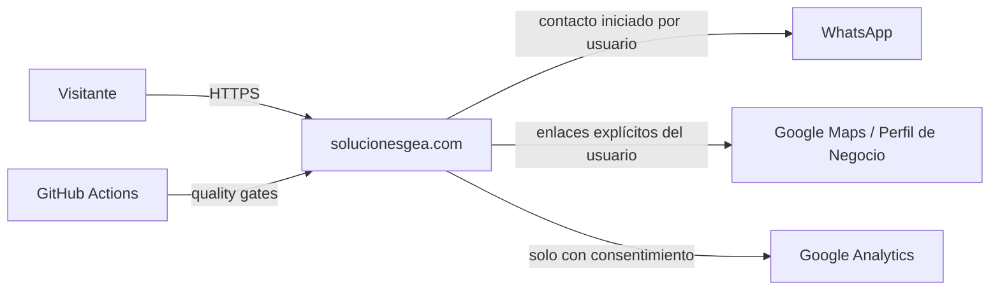

# Arquitectura de Soluciones GEA

Estado: vigente  
Última revisión: 2026-10-03

## Propósito
solucionesgea.com se diseña como una web empresarial rápida, segura, indexable y de baja complejidad operativa. No se introduce un framework o backend persistente mientras los requisitos no lo exijan.

## Principios
1. Static-first: HTML, CSS y JavaScript nativos.
2. Serverless only when needed: no mantener Functions cuando el requisito puede resolverse con contenido local estático.
3. No secrets in browser or repository.
4. Progressive enhancement y fallbacks ante terceros.
5. Analytics solo después de consentimiento.
6. Terceros no críticos fuera del camino de carga inicial.
7. Accesibilidad: semántica, teclado, foco y reduced-motion.
8. Netlify es el único despliegue automático de producción.
9. Decisiones estructurales mediante ADR.
10. Todo release pasa quality gates reproducibles.

## Contexto C4

```mermaid
flowchart LR
  U[Visitante] -->|HTTPS| S[solucionesgea.com]
  S -->|contacto iniciado por usuario| W[WhatsApp]
  S -->|enlaces explícitos del usuario| G[Google Maps / Perfil de Negocio]
  S -->|solo con consentimiento| A[Google Analytics]
  GH[GitHub Actions] -->|quality gates| S
```

## Contenedores
### Sitio estático
Contenido, SEO, navegación, formulario, tema, intro, accesibilidad, reseñas verificadas y evidencias locales.

### Snapshot de reputación
El rating, total y reseñas destacadas se conservan como snapshot local versionado. La página indica que no son datos en tiempo real y ofrece enlaces directos al perfil oficial de Google para consultar cambios posteriores. No existe llamada a Google Reviews/Places desde el runtime del sitio.

### Pipeline
- `scripts/release.js`: versionado, build metadata, protección de previews.
- `scripts/check.js`: estructura/SEO/release.
- `scripts/quality-gate.js`: arquitectura, seguridad, trazabilidad y mantenibilidad.

## Flujos
### WhatsApp
Los datos del formulario se validan en navegador y se convierten en un mensaje que el usuario decide enviar. GEA no los persiste en backend propio.

### Reseñas y evidencias
Las reseñas verificadas forman parte del HTML y su fuente auditable se conserva en `data/google-reviews.snapshot.json`. Las evidencias se sirven desde assets locales. Los enlaces a Google solo se abren por acción explícita del usuario.

### Analytics
Sin consentimiento no se carga Analytics y ninguna funcionalidad principal depende de él.

## Capas frontend
1. Foundation: `styles.css`, `brand.css`, `theme.css`.
2. Domain/page: `service-pages.css`, `service-media.css`.
3. Home base: `home-redesign.css`, `home-gauge-section.css`.
4. Home priority: `home-priority.css`, inyectado por release como última capa explícita.
5. Editorial/motion diferido: `gea-editorial-2026.css`, `gea-motion.css`, `service-icon-sizing.css`, cargados tras la intro.
6. Runtime: `app.js`, `home-redesign.js`, `hero-video.js`, `gea-motion.js`.
7. Critical intro: CSS mínimo embebido deliberadamente.

Regla: no crear una hoja global nueva para corregir un override. Se modifica el archivo propietario o se registra un ADR.

## Límites de confianza
- Browser: manipulable, sin secretos.
- No existe Function ni secreto para reseñas.
- Google/WhatsApp/Analytics: externos; su fallo no debe romper el contenido principal ni ocultar la reputación ya verificada.
- GitHub Actions: evidencia reproducible, no sustituto de revisión humana.

## Degradación
- Sin JS: la intro no bloquea el contenido.
- Sin Google: el snapshot local y las evidencias siguen visibles; solo fallan los enlaces externos al abrirlos.
- Sin Analytics: sitio funcional.
- Error de ruta: 404 explícito.

## Evolución
Backend persistente, autenticación, pagos, órdenes o inventario requieren nuevo ADR, actualización del threat model y pruebas específicas.
